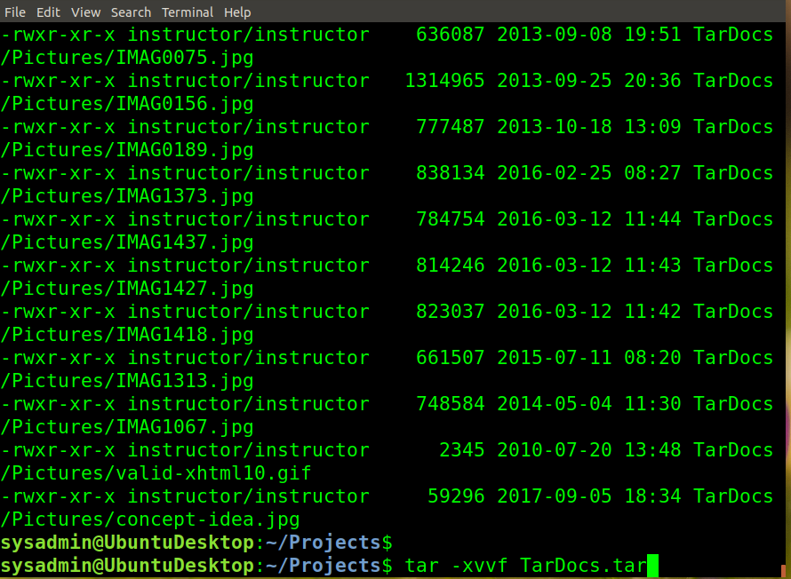
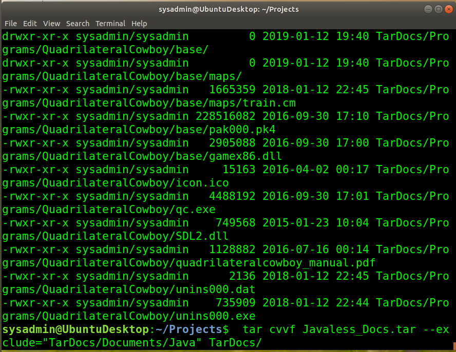
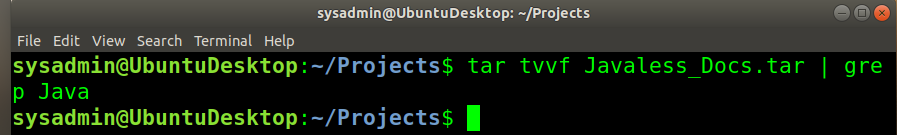

# CyberSecurity

Step 1: Create, Extract, Compress, and Manage tar Backup Archives

Command to extract the tTarDocs.tar archive to the current directory: 

        tar -xvvf TarDocs.tr

Command to create the Javaless_Doc.tar archive from the TarDocs/ directory, while excluding the TarDocs/Documents/Java directory:

        tar cvvf Javaless_Docs.tar --exclude="TarDocs/Documents/Java" TarDocs/

Command to ensure Java/ is not in the new Javaless_Docs.tar archive:

        tar tvvf Javaless_Docs.tar | grep Java

Step 2: Create, Manage, and Automate Cron Jobs

Cron job for backing up the /var/log/auth.log file:

        

Step 3: Write Basic Bash Scripts

Brace expansion command to create the four subdirectories:

Paste your system.sh script edits below:

#!/bin/bash
[Your solution script contents here]

Command to make the system.sh script executable:

Optional

Commands to test the script and confirm its execution:

Bonus

Command to copy system to system-wide cron directory:

Step 4. Manage Log File Sizes

Run sudo nano /etc/logrotate.conf to edit the logrotate configuration file.
Configure a log rotation scheme that backs up authentication messages to the /var/log/auth.log.

Add your config file edits below:

[Your logrotate scheme edits here]

Bonus: Check for Policy and File Violations

Command to verify auditd is active:

Command to set number of retained logs and maximum log file size:

Add the edits made to the configuration file below:

[Your solution edits here]

Command using auditd to set rules for /etc/shadow, /etc/passwd and /var/log/auth.log:

Add the edits made to the rules file below:

[Your solution edits here]

Command to restart auditd:

Command to list all auditd rules:

Command to produce an audit report:

Create a user with sudo useradd attacker and produce an audit report that lists account modifications:

Command to use auditd to watch /var/log/cron:

Command to verify auditd rules:

Bonus (Research Activity): Perform Various Log Filtering Techniques

Command to return journalctl messages with priorities from emergency to error:

Command to check the disk usage of the system journal unit since the most recent boot:

Comand to remove all archived journal files except the most recent two:

Command to filter all log messages with priority levels between zero and two, and save output to /home/sysadmin/Priority_High.txt:

Command to automate the last command in a daily cronjob. Add the edits made to the crontab file below:

[Your solution cron edits here]
