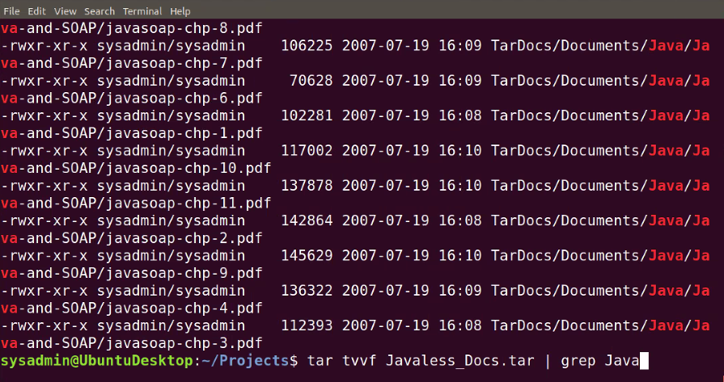
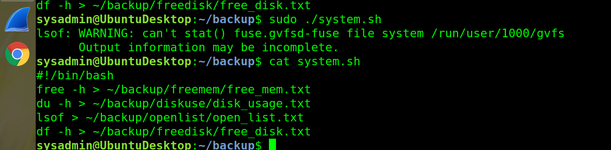

# CyberSecurity

Step 1: Create, Extract, Compress, and Manage tar Backup Archives

Command to extract the tTarDocs.tar archive to the current directory: 

        tar -xvvf TarDocs.tr

Command to create the Javaless_Doc.tar archive from the TarDocs/ directory, while excluding the TarDocs/Documents/Java directory:

        tar cvvf Javaless_Docs.tar --exclude="TarDocs/Documents/Java" TarDocs/

Command to ensure Java/ is not in the new Javaless_Docs.tar archive:

        tar tvvf Javaless_Docs.tar | grep Java

Step 2: Create, Manage, and Automate Cron Jobs

Cron job for backing up the /var/log/auth.log file:

        crontab-e

        

Step 3: Write Basic Bash Scripts

crontab-eC:\Users\hacker\CyberSecurity-101A\Homework-5\Image\createcron.png
Brace expansion command to create the four subdirectories:

Paste your system.sh script edits below:

#!/bin/bash

        [0 6 * * */4 tar -zcf /auth_backup.tgz /var/log/auth.log]

Command to make the system.sh script executable:

        sudo ./system.sh

Step 4. Manage Log File Sizes

Run sudo nano /etc/logrotate.conf to edit the logrotate configuration file.
Configure a log rotation scheme that backs up authentication messages to the /var/log/auth.log.

Add your config file edits below:

[Your logrotate scheme edits here]

