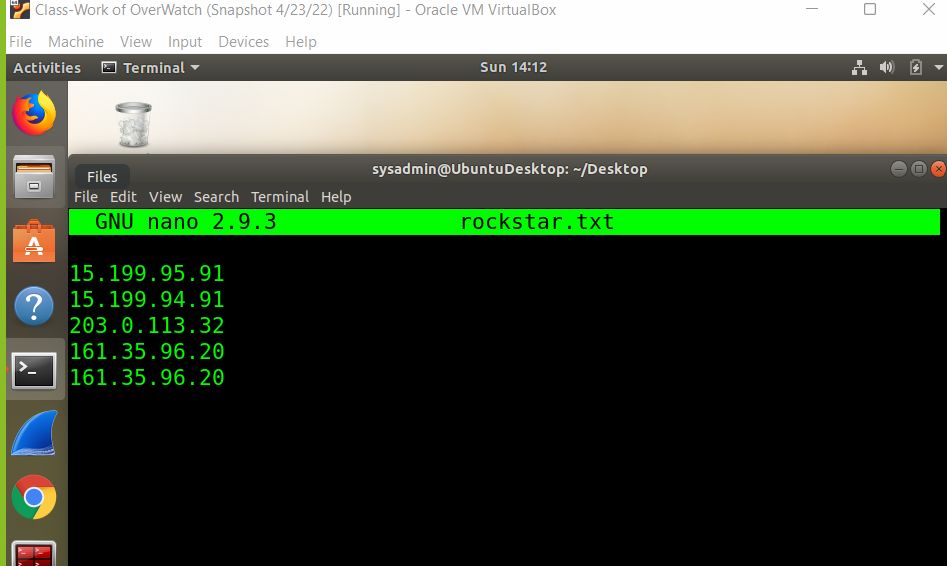
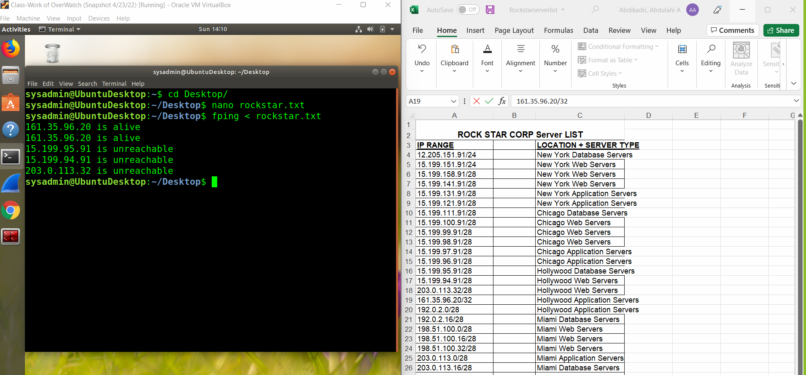
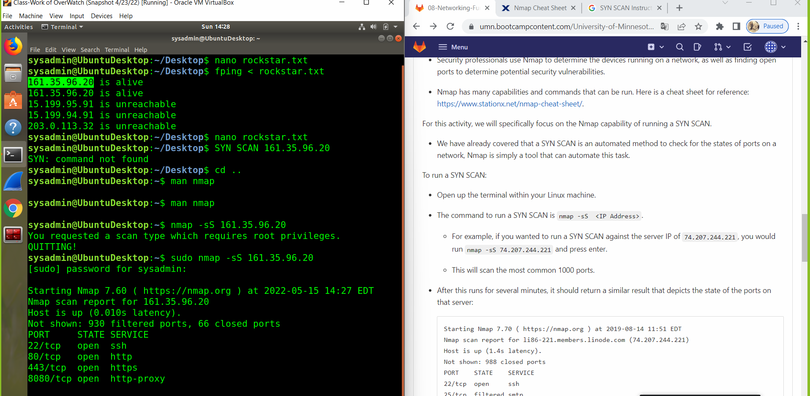
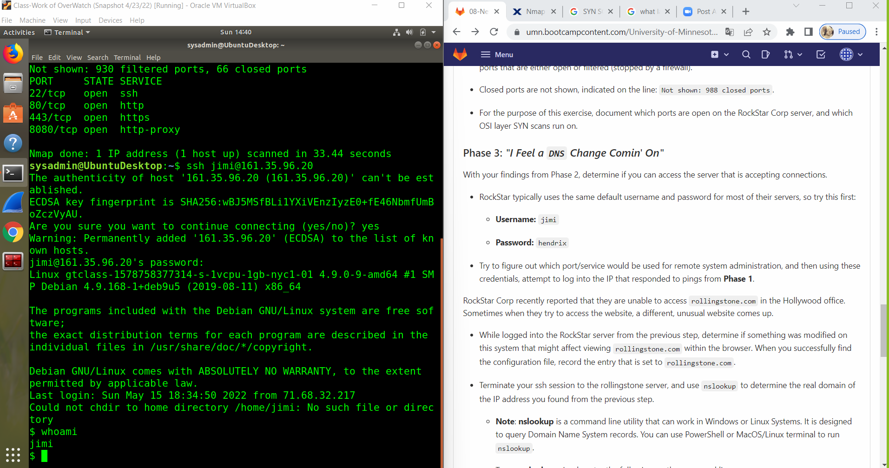
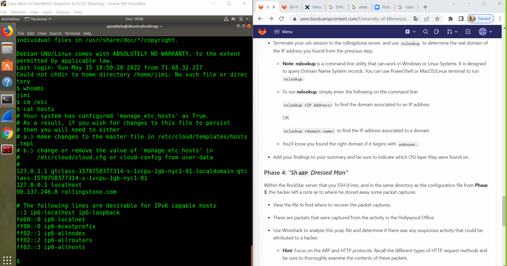
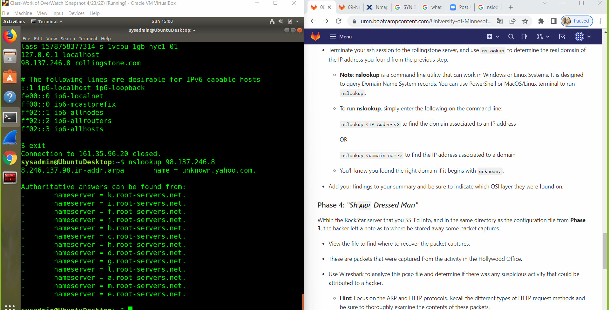

Your Submission:  "Its the End of the Assessment as We Know It, and I Feel Fine"

Guidelines for your Submission:
Provide the following for each phase:

List the steps and commands used to complete the tasks.

Phase 1

i type Nano Rockstar

        nano rockstar.txt

then i ran this command to check which server is a live in the Hollywood's office

       fping < rockstar.txt 

Phase 2

i ran this to SYN SCAN and also see which port is open

        sudo nmap -sS 161.35.96.20

i found four ports which were open

Phase 3

i typed this commnand

        ssh jimi@161.31.96.20
than i put in a password hendrix

than i typed whoami 

than i changed directory

        cd /etc/
than i ran this command

    cat hosts

i found the ip address of rollingstone.com

i ran nslookup to find the unknown

        nslookup 98.137.246.8

Phase 4

these are the commands are used first

        ssh jimi@161.31.96.20

then I logged in password   
        hendrix

then i type this commands

        cat packetcaptureinfo.txt

then it gave me a link https://drive.google.com/file/d/1ic-CFFGrbruloYrWaw3PvT71elTkh3eF/view?usp=sharing

then i typed HTTP.request.method =="post"
after that i found the message of the hacker

finnally it's Layer 7 in the OSI