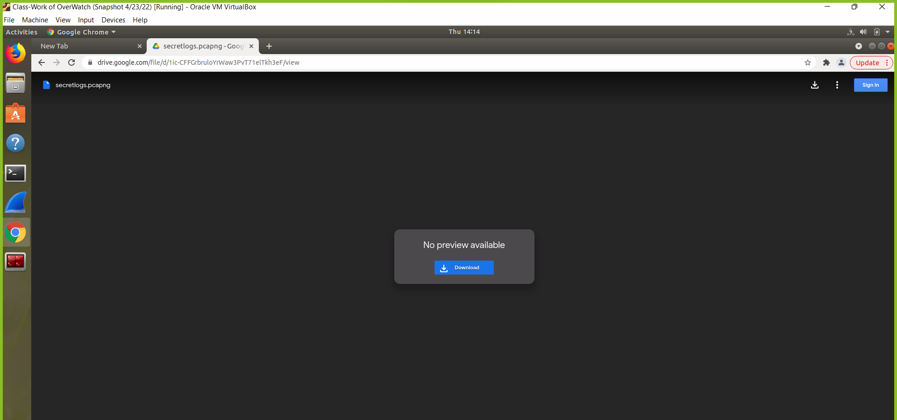
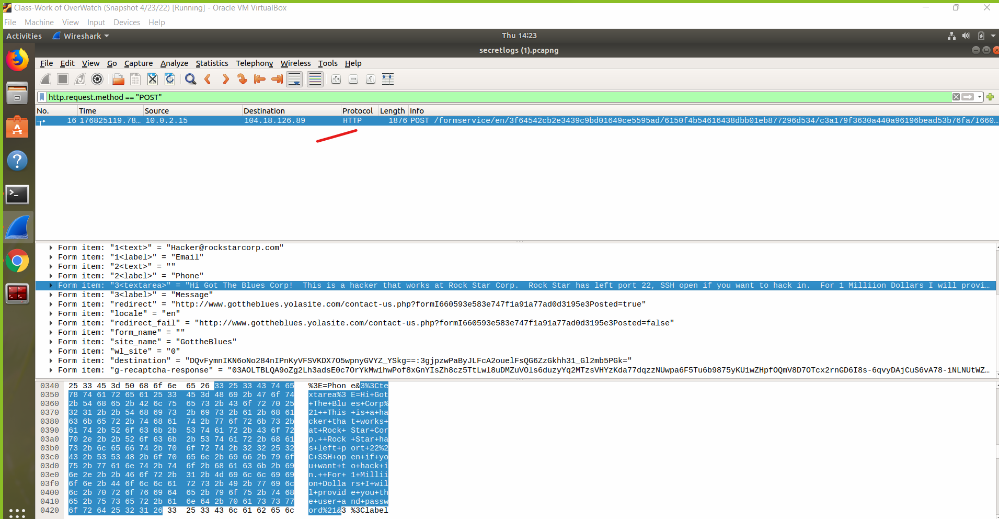

Your Submission:  "Its the End of the Assessment as We Know It, and I Feel Fine"

Guidelines for your Submission:
Provide the following for each phase:

List the steps and commands used to complete the tasks.

List any vulnerabilities discovered.

List any findings associated to a hacker.

Document the mitigation recommendations to protect against the discovered vulnerabilities.

Document the OSI layer where the findings were found.

For example:
Phase 1

Phase 4

these are the commands are used first

        ssh jimi@161.31.96.20

then I logged in password   
        hendrix

then i type this commands

        cat packetcaptureinfo.txt

then it gave me a link https://drive.google.com/file/d/1ic-CFFGrbruloYrWaw3PvT71elTkh3eF/view?usp=sharing

then i typed HTTP.request.method =="post"
after that i found the message of the hacker

finnally it's Layer 7 in the OSI