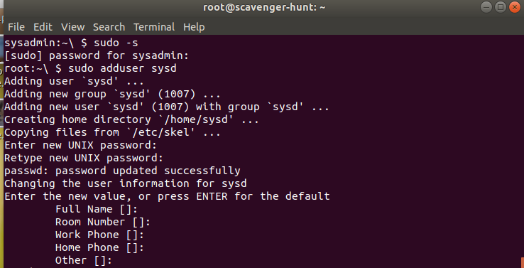
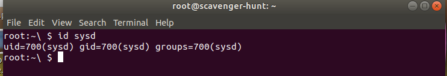
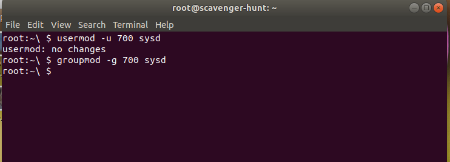
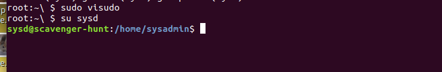
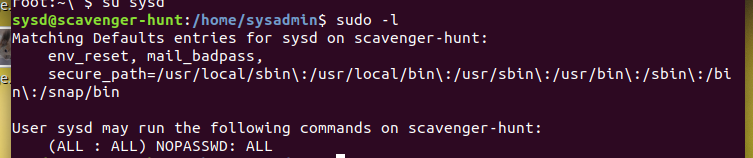
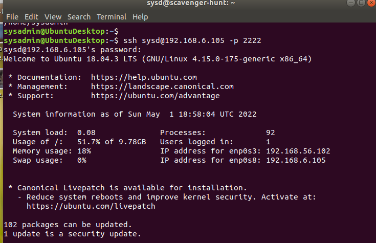
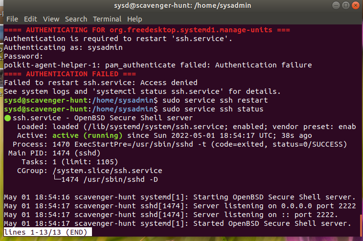
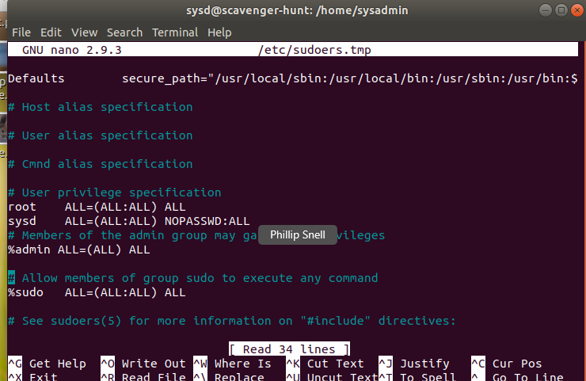
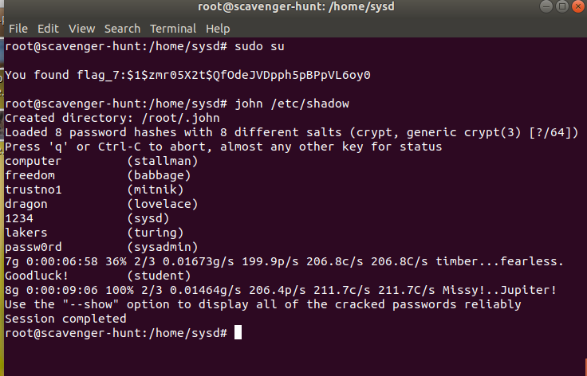

# CyberSecurity

Week 6 Homework Submission File: Advanced Bash - Owning the System
Please edit this file by adding the solution commands on the line below the prompt
Save and submit the completed file for your homework submission.
Step 1: Shadow People

      sudo adduser sysd

        
Create a secret user named sysd. Make sure this user doesn't have a home folder created:

Your solution command here

Give your secret user a password: 1234

Give your secret user a system UID < 1000: 700

        usermod -u 700 sysd

 

Give your secret user the same GID: 700

        groupmod -g sysd

Give your secret user full sudo access without the need for a password:

        sudo visudo

Test that sudo access without password

        su sysd
        sudo -l

Step 2: Smooth Sailing

Edit the sshd_config file:

         ssh sysd@192.168.6.105 -p 2222

Step 3: Testing Your Configuration Update.

Restart the SSH service:

        sudo service ssh restart

Exit the root account:

        exit

SSH to the target machine using your sysd account and port 2222:

        sudo nano /etc/sshd_config

Use sudo to switch to the root user:

        sudo su

Step 4: Crack All the Passwords

SSH back to the system using your sysd account and port 2222:

        sudo visudo

.

Escalate your privileges to the root user. Use John to crack the entire /etc/shadow file:

        john /etc/shadow

john /etc/shadow
